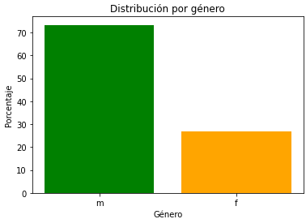
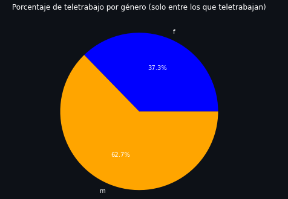
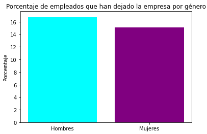
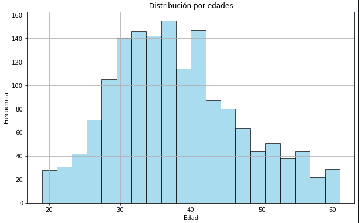
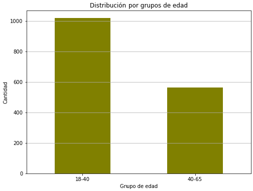

## Análisis de los datos sobre satisfacción:

Tras un análisis y varias visualizaciones, podemos afirmar que **se repite un patron en la satisfacción de los empleados**, tanto en tipos de satisfacción como en distinciones por diferentes grupos demográficos.

Podemos observar en el gráfico que los tres tipos de satisfacción (relaciones interpersonales, trabajo y entorno de trabajo) tienen valores parecidos en todos los niveles. **En general, alrededor del  29.5% de los empleados está muy satisfecho, 30.5% satisfecho, el 20% poco satisfecho y el 19% nada satisfecho** . Este patrón se cumple también al diferenciar los empleados por género y por edad. También muestra datos parecidos el grupo de trabajadores que ya no se encuentra en la empresa.

Cabe destacar que, aunque sea bueno que el patrón se repita y, por lo tanto, no se esté discriminando a nadie (al menos no de manera importante) en cuestiones de sexo o edad, los porcentajes no son demasiado buenos ya que, si pusieramos el límite entre poco satisfecho y satisfecho (justo en medio de la escala de satisfacción) los trabajadores se repartiría entre 60% satisfechos y 40% no satisfechos (apróximandamente) en todos los casos, dato que **podría mejorar significativamente**.

Como casos particulares destacamos: 

- Los **antiguos empleados** han tenido una satisfacción especialmente baja.
    - en cuanto al entorno de trabajo solo el 24.7 decía estar muy satisfecho frente al 30.5% que no estaba nada satisfecho.

    

    - en cuanto al trabajo baja a 22.4% los muy satisfechos, estando el 27.1% nada satisfecho.

    

- Los **mayores de 40 años** también muestran un nivel de satisfacción especialmente bajo en cuanto a la satisfaccion por el trabajo realizado y las relaciones interpersonales y se diferencian bastante de los menores de 40 en ambos ámbitos.

- Las **mujeres** están menos satisfechas que los hombres en cuanto a la satisfacción por el trabajo y en las relaciones interpersonales. Las mujeres muy satisfechas suponen el 28.7% en la satisfacción por el trabajo frente al 33.5% en los hombres y en cuanto a las relaciones interpersonales el 27.9% frente al 30.0% en los hombres.

## Análisis sobre la distribución por edad y género 

La mayoría de los empleados que trabajan en la empresa son hombres, para romper con la brecha de género aparente podríamos fomentar la contratacion de mujeres. 

Hombres    60.19%
Mujeres    39.81%

En lo que respecta el teletrabajo , el porcentaje más alto lo encontramos en hombres , podría realizarse un estudio para saber cuales son las causas de la diferencia y establecer medidas del tipo que corresponda si son oportunas para igual las condiciones. 

Mujeres    37.26%
Hombres    62.74%

Y por último , el porcentaje de hombres que han dejado los hombres la empresa varía muy ligeramente en comparación al porcentaje de las mujeres. 

Porcentaje de hombres que han dejado la empresa: 16.82%
Porcentaje de mujeres que han dejado la empresa: 15.10%

Respecto a las edades, nos encontramos con trabajadores de entre los 19 y 61 años donde predomina el rango de edad entre los 18 y 40 en este caso. 
Podemos deducir que existe una diferencia generacional por lo que nos encontramos una experiencia laboral variada, donde los jóvenes tienen más fuerza.

Grupo 18-40    1018 empleados
Grupo 40-65     562 empleados 

## Análisis Calificación rendimiento del empleado y el porcentaje de aumento salarial
Los empleados con una calificación de 3 tienen incrementos salariales que generalmente son menores al 15%, mientras que los empleados con una calificación de 4 pueden recibir aumentos salariales que llegan hasta el 25%. Esta disparidad en los incrementos salariales podría ser un factor que contribuye a que algunos empleados decidan abandonar la empresa. De hecho, el 73% de los empleados que abandonaron la empresa tenían una calificación de 3.

## Análisis  porcentaje de aumento salarial con el total de años en la compañia
Observamos incrementos salariales que varían  un rango del 10% al 25%, . La gráfica presenta intervalos de confianza amplios, lo que sugiere una variabilidad significativa en los aumentos salariales. Además, es evidente que existen empleados con un número similar de años en la compañía que reciben incrementos salariales diferentes, lo que sugiere que otros factores, como el desempeño laboral o la negociación salarial, pueden estar influyendo en estas diferencias.

 La interpretación de la gráfica de dispersión muestra que no hay una relación directa entre el aumento salarial y el número de años trabajados en la compañía. La forma casi horizontal de la distribución de puntos sugiere que, en general, el aumento salarial no aumenta consistentemente con la antigüedad en la empresa.

## Análisis  calificacion rendimiento del empleado con el total de años en la compañia
En la gráfica anterior, hemos observado que los empleados de categoría 4 recibían aumentos de salario más altos que los empleados de categoría 3. En esta grafica ambos grupos de empleados muestran un número de años en la empresa similar. Sin embargo, es notable que para el grupo de empleados de categoría 4, el intervalo de confianza es significativamente más amplio.Esta diferencia en la variabilidad de los años trabajados sugiere que, aunque ambos grupos tienen una antigüedad laboral comparable, existe una mayor diversidad en la experiencia laboral en esta empresa de los empleados de categoría 4. 

