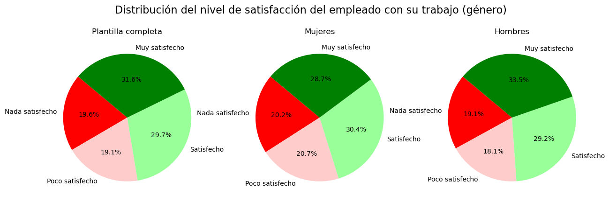

## Análisis de los datos sobre satisfacción:

Tras un análisis y varias visualizaciones, podemos afirmar que **se repite un patron en la satisfacción de los empleados**, tanto en tipos de satisfacción como en distinciones por diferentes grupos demográficos.

Podemos observar en el gráfico que los tres tipos de satisfacción (relaciones interpersonales, trabajo y entorno de trabajo) tienen valores parecidos en todos los niveles. **En general, alrededor del  29.5% de los empleados está muy satisfecho, 30.5% satisfecho, el 20% poco satisfecho y el 19% nada satisfecho** . Este patrón se cumple también al diferenciar los empleados por género y por edad. También muestra datos parecidos el grupo de trabajadores que ya no se encuentra en la empresa.

Cabe destacar que, aunque sea bueno que el patrón se repita y, por lo tanto, no se esté discriminando a nadie (al menos no de manera importante) en cuestiones de sexo o edad, los porcentajes no son demasiado buenos ya que, si pusieramos el límite entre poco satisfecho y satisfecho (justo en medio de la escala de satisfacción) los trabajadores se repartiría entre 60% satisfechos y 40% no satisfechos (apróximandamente) en todos los casos, dato que **podría mejorar significativamente**.

Como casos particulares destacamos: 

- Los **antiguos empleados** han tenido una satisfacción especialmente baja.
    - en cuanto al entorno de trabajo solo el 24.7 decía estar muy satisfecho frente al 30.5% que no estaba nada satisfecho.

    

    - en cuanto al trabajo baja a 22.4% los muy satisfechos, estando el 27.1% nada satisfecho.

    

- Los **mayores de 40 años** también muestran un nivel de satisfacción especialmente bajo en cuanto a la satisfaccion por el trabajo realizado y las relaciones interpersonales y se diferencian bastante de los menores de 40 en ambos ámbitos.

- Las **mujeres** están menos satisfechas que los hombres en cuanto a la satisfacción por el trabajo y en las relaciones interpersonales. Las mujeres muy satisfechas suponen el 28.7% en la satisfacción por el trabajo frente al 33.5% en los hombres y en cuanto a las relaciones interpersonales el 27.9% frente al 30.0% en los hombres.

